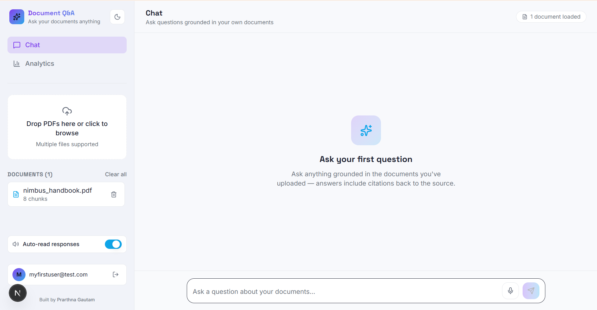
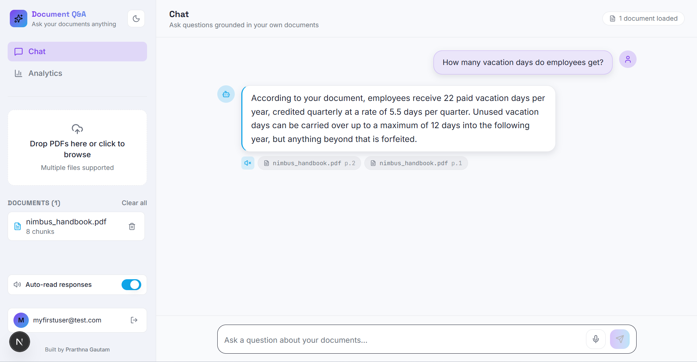
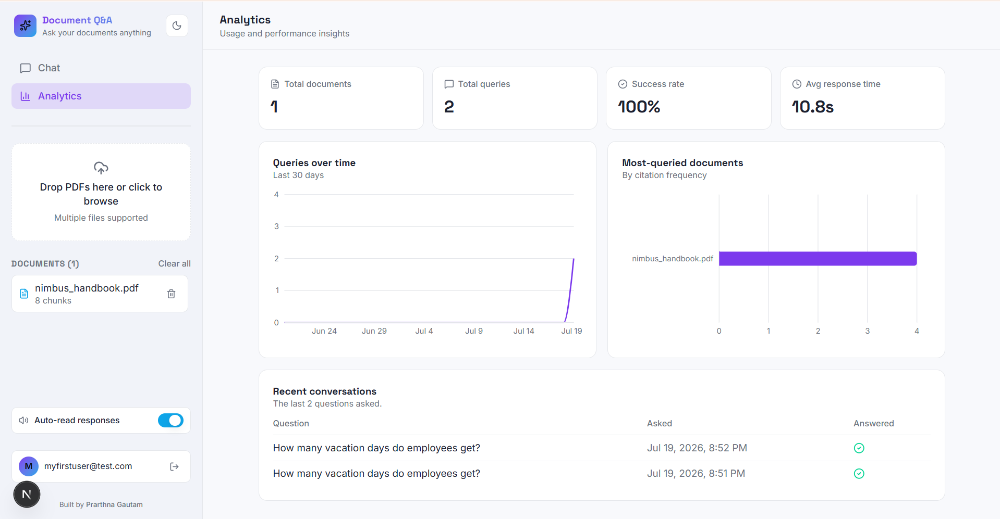

# Document Q&A

[](https://github.com/prarthnagautam1094/document-qa-industry/actions/workflows/backend-ci.yml)
[](https://github.com/prarthnagautam1094/document-qa-industry/actions/workflows/frontend-ci.yml)

A multi-user, retrieval-augmented Q&A application for PDF documents. Upload
PDFs, ask questions grounded in their content, and get cited answers — with
each signed-in user's documents and chat history fully isolated from every
other user's.

### Author

Created by **[Prarthna Gautam](https://github.com/prarthnagautam1094)**.

## Overview

This project pairs a FastAPI backend (RAG pipeline over a vector store) with
a Next.js frontend (chat UI, document management, auth). Users sign up with
email/password (via Supabase Auth), upload PDFs, and ask questions that are
answered strictly from the content of their own uploaded documents — the
backend never mixes retrieval, chat history, or document listings across
users.

## Architecture

```
                     ┌─────────────────────┐
  Browser  ───────▶  │   Next.js frontend   │
                     │  (chat UI, upload,   │
                     │   login/signup)      │
                     └──────────┬───────────┘
                                │  Authorization: Bearer <Supabase JWT>
                                ▼
                     ┌─────────────────────┐
                     │   FastAPI backend    │
                     │  ┌────────────────┐  │
                     │  │ auth_service    │◀─┼───▶  Supabase Auth (verify JWT)
                     │  ├────────────────┤  │
                     │  │ rag_service     │  │
                     │  │ (chunk/embed/   │  │
                     │  │  retrieve/ask)  │  │
                     │  ├────────────────┤  │
                     │  │ chroma_service  │◀─┼───▶  Chroma (vector store,
                     │  ├────────────────┤  │        on disk, per-user
                     │  │ database        │  │        metadata filter)
                     │  └────────────────┘  │
                     └──────────┬───────────┘
                                │
                     ┌──────────┴───────────┐
                     ▼                      ▼
             Postgres (Supabase)        Groq LLM API
          (documents, conversations,   (query rewrite +
              query_logs — all           answer generation)
              scoped by user_id)
```

**Request flow for a question:**

1. Frontend attaches the signed-in user's Supabase access token to every API call.
2. `auth_service.get_current_user()` verifies the token against Supabase Auth and extracts the `user_id`.
3. The follow-up question is rewritten into a standalone query using recent conversation history (if any).
4. Chroma is searched for relevant chunks, **filtered to that `user_id`'s own documents only**, then re-ranked with a cross-encoder for precision.
5. Groq generates an answer grounded in the retrieved chunks, or a fixed fallback message if nothing relevant was found.
6. The turn and its performance metrics are logged to Postgres, scoped to the same `user_id`.

## Features

- **PDF ingestion** — upload one or more PDFs; each is chunked, embedded, and stored in a per-user-filtered vector collection.
- **Retrieval-augmented chat** — two-stage retrieval (bi-encoder search + cross-encoder re-ranking) grounds every answer in the user's own uploaded content, with source citations (`filename (p. N)`).
- **Conversational follow-ups** — elliptical questions ("what about maternity?") are rewritten into standalone queries using recent chat history before retrieval.
- **Multi-user auth & data isolation** — email/password auth via Supabase; every document, chat turn, and query log is scoped to the authenticated user, so User A can never see or modify User B's data.
- **Document management** — list and delete uploaded documents, with the corresponding vectors and database rows removed together.
- **Query analytics** — per-user aggregate stats (total queries, average response time, success rate).
- **Offline-aware UI** — the frontend detects when the backend is unreachable and shows a clear reconnect state instead of a silently broken app.

## Screenshots


*The initial chat view, ready for a question.*


*A grounded answer with source citations back to the uploaded PDF.*


*Usage stats and charts on the analytics dashboard.*

## Tech stack

**Backend**
- FastAPI + Uvicorn
- LangChain (`langchain-community`, `langchain-groq`, `langchain-text-splitters`)
- ChromaDB (vector store) with `sentence-transformers` embeddings (`all-MiniLM-L6-v2`) and a cross-encoder re-ranker (`ms-marco-MiniLM-L-6-v2`)
- Groq (`llama-3.3-70b-versatile`) for query rewriting and answer generation
- SQLAlchemy + PostgreSQL (Supabase-hosted) for persistence
- `supabase-py` for JWT verification
- pytest for integration testing

**Frontend**
- Next.js 16 (App Router) + React 19 + TypeScript
- Tailwind CSS v4
- `@supabase/supabase-js` for auth
- Framer Motion, `react-markdown`, `sonner` (toasts)

## Project structure

```
document-qa-industry/
├── backend/
│   ├── main.py              # FastAPI app, middleware, routers
│   ├── config.py            # Centralized settings from environment
│   ├── database.py          # SQLAlchemy models + persistence helpers
│   ├── models/schemas.py    # Pydantic request/response models
│   ├── routers/             # documents.py, chat.py
│   ├── services/            # auth_service, chroma_service, rag_service
│   ├── tests/                # pytest integration test suite
│   └── evaluation/           # RAG quality evaluation (ragas)
└── frontend/
    ├── app/                  # Next.js App Router pages (chat, analytics, login)
    ├── components/           # UI components (Sidebar, ChatInterface, etc.)
    ├── context/              # AuthContext, AppStateContext, ThemeContext
    ├── hooks/                # useChat
    └── lib/                  # api.ts (backend client), supabase.ts, types.ts
```

## Setup

### Prerequisites

- Python 3.11+
- Node.js 20+
- A [Supabase](https://supabase.com) project (for Postgres + Auth)
- A [Groq](https://console.groq.com) API key

### Backend

```bash
cd backend
python -m venv venv
./venv/Scripts/activate      # Windows
# source venv/bin/activate   # macOS/Linux

pip install -r requirements.txt

cp .env.example .env
# then fill in GROQ_API_KEY, DATABASE_URL, SUPABASE_URL, SUPABASE_ANON_KEY

uvicorn main:app --reload --port 8001
```

The API is now available at `http://127.0.0.1:8001` (interactive docs at `/docs`).

### Frontend

```bash
cd frontend
npm install

cp .env.example .env.local
# then fill in NEXT_PUBLIC_API_URL, NEXT_PUBLIC_SUPABASE_URL, NEXT_PUBLIC_SUPABASE_ANON_KEY

npm run dev
```

The app is now available at `http://localhost:3000`.

### Docker (alternative to running each service manually)

Once `backend/.env` and `frontend/.env.local` are filled in (see above), the
whole stack can run as two containers instead of a local Python venv +
`npm run dev`:

```bash
docker compose --env-file frontend/.env.local up --build
```

The `--env-file frontend/.env.local` part matters: Next.js inlines
`NEXT_PUBLIC_*` variables into the client bundle at *build* time, so they're
passed to the frontend image as Docker build args, substituted from that
file — not from `env_file:` (which only affects the running container,
too late for a value already baked into the JS bundle). Plain
`docker compose up --build` still works, but the Supabase variables come
through blank and the frontend falls back to its "not configured" warning.

This starts:
- the backend at `http://localhost:8001` (`/health`, `/docs`), with uploaded
  documents' embeddings persisted in a named Docker volume across restarts
- the frontend at `http://localhost:3000`, waiting on the backend's
  healthcheck before starting

Rebuild after a dependency change with `docker compose build`; tear down with
`docker compose down` (add `-v` to also drop the persisted Chroma volume).

### Supabase configuration

1. Create a Supabase project. Copy its Postgres connection string into `backend/.env` as `DATABASE_URL`, and its Project URL / anon key into both `backend/.env` (`SUPABASE_URL`, `SUPABASE_ANON_KEY`) and `frontend/.env.local` (`NEXT_PUBLIC_SUPABASE_URL`, `NEXT_PUBLIC_SUPABASE_ANON_KEY`).
2. In **Authentication → Providers → Email**, enable email/password sign-in. Disable "Confirm email" if you want new signups to be logged in immediately without clicking a confirmation link.
3. The backend creates its own tables (`documents`, `conversations`, `query_logs`) automatically on startup — no manual schema setup needed.

## Running tests

```bash
cd backend
pytest
```

The suite runs real integration tests against the configured Chroma store, Postgres database, and Groq API (no mocks) — retrieval thresholds, prompt behavior, and chunking are exactly the things a mocked test would hide. The `get_current_user` auth dependency is overridden with a fixed test user id for most tests (see `tests/conftest.py`); `tests/test_auth.py` specifically exercises the real 401 behavior.

There is also a separate RAG-quality evaluation harness (faithfulness, answer relevancy, context precision/recall via `ragas`) at `backend/evaluation/run_eval.py`.

## CI/CD

Two GitHub Actions workflows run on every push/PR to `main`:

- **[Backend CI](.github/workflows/backend-ci.yml)** — installs `backend/requirements.txt` and runs the real pytest suite. Because that suite hits live Chroma, Postgres, Groq, and Supabase Auth rather than mocks (see "Running tests" above), it needs these **repository secrets** (Settings → Secrets and variables → Actions):

  | Secret | Value |
  |---|---|
  | `GROQ_API_KEY` | Same value as `backend/.env` |
  | `DATABASE_URL` | Same value as `backend/.env` |
  | `SUPABASE_URL` | Same value as `backend/.env` |
  | `SUPABASE_ANON_KEY` | Same value as `backend/.env` |

  Without all four set, the workflow fails on the first Supabase- or database-dependent test rather than being skipped. Since the tests place real calls against Groq and the hosted Postgres instance, a run can also fail from an external rate limit or outage, not just a code regression.

- **[Frontend CI](.github/workflows/frontend-ci.yml)** — runs `npm run lint` and `npm run build` (which type-checks as part of the build). No secrets required — `NEXT_PUBLIC_*` values only need to be well-formed strings for the build to succeed, so the workflow uses harmless placeholders instead of real Supabase config.

## License

MIT © 2026 [Prarthna Gautam](https://github.com/prarthnagautam1094) — see [LICENSE](LICENSE).
